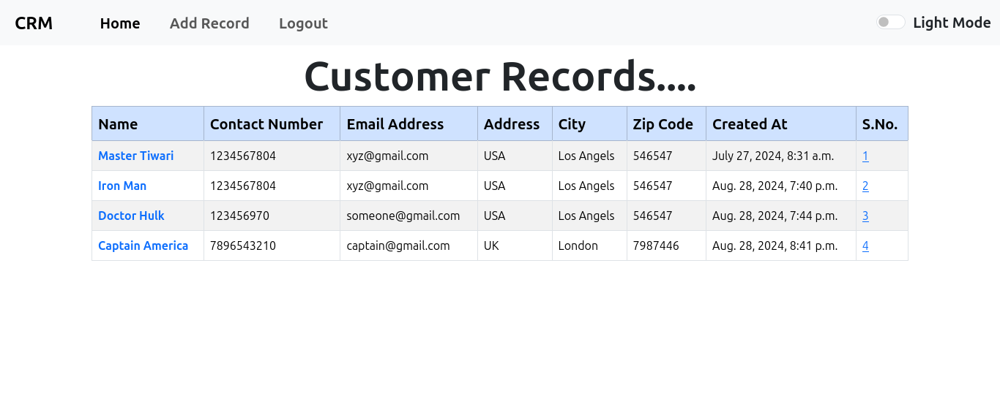
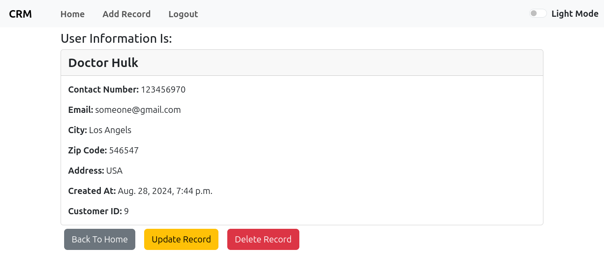
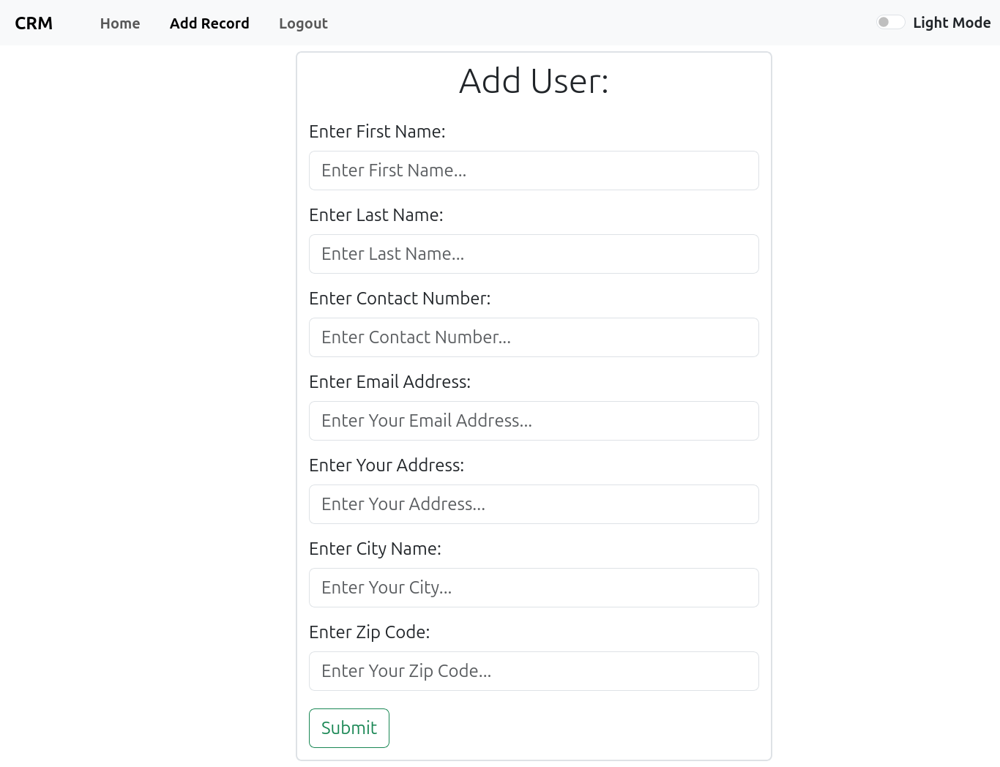

# Django CRM Application

## Overview
Welcome to our CRM (Customer Relationship Management) application documentation. This document aims to provide you with an overview of the application's features, how to use them, and other relevant information.

## Features :-

- **Customer Data Management**: Store and manage customer information such as name, address, email, etc.
- **Login and Logout**: Secure authentication system for users to log in and log out.
- **Dashboard**: Overview of customer.

- **Customization**: Customize fields and settings to suit your business needs.

## ScreenShots :-

Here are some screenshots of the application :-

- **Home Page :-** The home page shows total added records.
    

- **User Details:-** This Page Show user details.
     

- **Add Record:-** This Page enables to add new record to database.
    

## Requirements

- Python 3.12+
- Django 5.12
- PostgresSQL